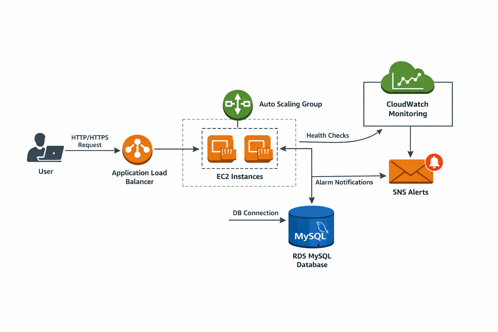

# AWS Highly Available Web Application Architecture

This project demonstrates the design and deployment of a highly available and scalable web application on AWS.

It leverages EC2, Auto Scaling, Application Load Balancer, RDS, CloudWatch, and SNS to simulate a real-world production architecture.

## Prerequisites

- AWS Account
- Basic knowledge of EC2, RDS, and VPC
- IAM permissions to create resources
- Key pair for SSH access

## Architecture Overview

The application is deployed across multiple Availability Zones to ensure high availability and fault tolerance.

Key components include:
- EC2 instances running a web application
- Auto Scaling Group for dynamic scaling
- Application Load Balancer for traffic distribution
- Amazon RDS (MySQL) for database
- CloudWatch for monitoring
- SNS for notifications

## Architecture Diagram

The following diagram illustrates the overall system design and how components interact:

## Implementation Steps

1. Created a Launch Template with EC2 configuration and user data.
2. Configured an Auto Scaling Group across multiple Availability Zones.
3. Set up an Application Load Balancer with a Target Group.
4. Registered EC2 instances and configured health checks.
5. Deployed a MySQL database using Amazon RDS.
6. Configured CloudWatch monitoring and alarms.
7. Set up SNS notifications for alerting.
8. Simulated failure scenarios to test high availability.

## Screenshots

### Application Running

### Connected to EC2 Instance via SSH

### RDS Instance in Available State

### MySQL Connection Successful

### CloudWatch Dashboard: CPU Utilization Metrics

### CloudWatch Alarms: EC2 and RDS High CPU

### CloudWatch Alarm: CPU Utilization Exceeds Threshold

### CloudWatch Alarm Notification via Amazon SNS

### Auto Scaling Group Self-Healing in Action

### ALB Target Group: EC2 Instance Registered and Healthy

## Key Features

- High availability using Multi-AZ deployment
- Auto Scaling for handling traffic dynamically
- Load balancing across multiple EC2 instances
- Database integration using Amazon RDS
- Monitoring and alerting with CloudWatch and SNS
- Fault tolerance tested through simulated failures

## Outcome

Successfully built and tested a highly available and scalable AWS architecture capable of handling failures and distributing traffic efficiently.

